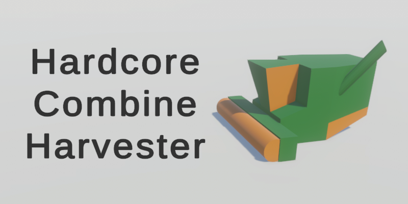

# Hardcore Combine Harvester - Ludum Dare 52

> TODO: Add description

My entry to the 52:nd Ludum Dare game jam (theme: *Harvest*), following the compo rules (alone, from scratch, 48 hours).

[Play the game in Your browser](https://aggrathon.github.io/LudumDare52/) or [check out the Ludum Dare entry](https://ldjam.com/events/ludum-dare/52/hardcore-combine-harvester)!

## Software Used

Unity (game engine), Visual Studio Code (code), Paint.net (art), Audacity (audio), Blender (art), git (version control), and Github (hosting).

> TODO: Add screenshots